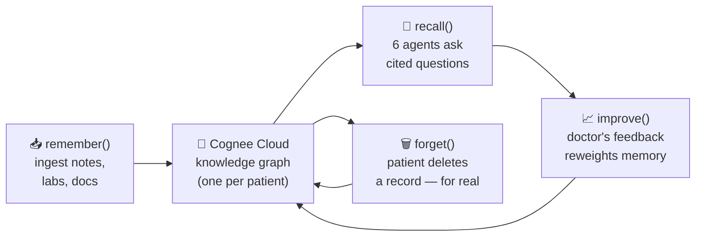
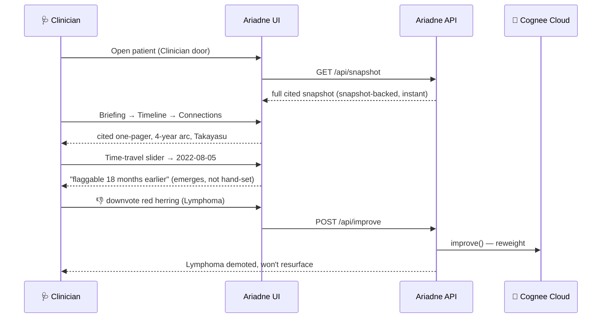
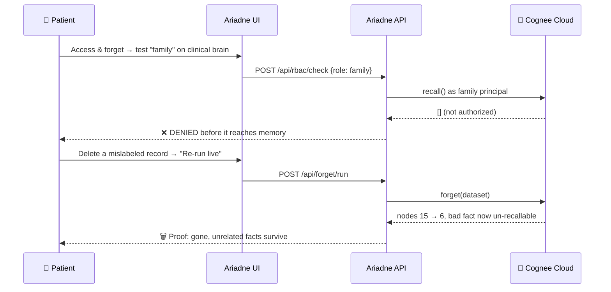

# Ariadne 🧵

**A patient-owned clinical memory & insight layer on [Cognee Cloud](https://docs.cognee.ai/).**
*Ariadne's thread guides clinicians and patients out of the diagnostic labyrinth.*

> **Hackathon theme: Best Use of Cognee Cloud.** Every Cloud-exclusive lever —
> multi-tenant RBAC, agents-as-principals, Sessions observability, hosted persistence —
> and the full `remember → recall → improve → forget` lifecycle is **load-bearing**, not
> decorative. Ariadne is impossible on plain vector RAG.

📖 **New to the project? Start with the story:** [**"The Girl Whose Pulse Went Missing"**](docs/medium-article.md)
— a human, India-centric walkthrough of the real problem Ariadne solves. Also see the
[architecture & diagrams](docs/architecture.md) and the [3-minute demo script](docs/demo-script.md).

---

## The problem

Most diagnostic delay isn't missing data — it's **un-connected** data scattered across
years, providers, and documents nobody read side-by-side. A patient sees seven specialists
over four years; each applies a plausible wrong label ("post-viral", "iron deficiency",
"fibromyalgia", "anxiety") to the slice in front of them. The signal was always there — it
was never in *one note*.

**Ariadne ingests the whole mess into one longitudinal knowledge graph per patient**, then a
swarm of six narrow, **cited** specialist agents reconstruct the story and surface the
questions no single visit could see — every finding traceable to the source note it came from.

> ⚕️ **Decision support only.** Ariadne surfaces *questions to investigate*, always
> human-in-the-loop. It never states a diagnosis, and any finding without a traceable
> citation is suppressed. Designed to the FDA CDS-exemption criteria (shows its basis,
> enables independent review, never the sole basis).

---

## The hero case

The demo patient (fully synthetic, no PHI) is a young woman whose four-year odyssey ends in a
confirmed diagnosis of **Takayasu arteritis** (a large-vessel vasculitis). Her records are
seeded into Cognee Cloud and every panel below is backed by a **real Cloud recall with real
citations**.

The mic-drop: Ariadne's time-travel counterfactual shows the connected memory could have
flagged large-vessel vasculitis **18 months before** the real diagnosis — and the number
*emerges from the computation*, it is not hand-set.

---

## What it does (the six agents + two signature features)

| Agent | Job | Cognee call | Guardrail |
| --- | --- | --- | --- |
| **Timeline** | The four-year arc, date-ordered | temporal / graph recall | facts only, all cited |
| **Connections** | Differential *support* (constellation → literature pattern) | graph recall + references | "consider / investigate", ≥1 citation per hop |
| **Trials** | Match patient ↔ open-trial eligibility | graph recall over `[clinical, trials]` | shows *unmet* criteria too |
| **Safety** | Polypharmacy / interaction & duplication | med subgraph + curated rules | flags, never changes meds |
| **Briefing** | 10-second cited pre-visit one-pager | graph recall (summaries) | derived only from cited memory |
| **Justify** | Prior-auth evidence packet | graph recall (dx + step-therapy + trials) | assembles, does not submit |

**Signature features**

1. **Time-travel counterfactual** — reconstruct the as-of-date subgraph and re-run the
   ranking: *"flaggable 18 months earlier."* Honest — the headline flag requires a genuine
   vascular sign, not constitutional overlap alone.
2. **Cited red-thread** — every finding traces back over **real graph edges** to the exact
   source-document chunk that backs it. The UI can only draw edges the graph actually contains.

**Cloud-native lifecycle (all proven live)**

- **RBAC** — a *family* principal recalling the clinical brain gets `[]` (denied); a *provider*
  gets the cited answer. Real roles + real dataset grants on the tenant; the app is the
  enforcement boundary.
- **Sessions** — every agent runs under a structured session id, so the Sessions plane is a
  per-agent audit log (who asked what, what memory answered) with zero extra instrumentation.
- **improve() / memify** — a clinician 👎 on a red herring demotes it and it never
  re-surfaces; precision@k rises 0.5 → 1.0 and never regresses.
- **forget() with proof** — deleting a mislabeled record surgically removes exactly its nodes
  (before/after graph + recall proof); unrelated concepts survive.

---

## How Cognee Cloud powers the core

Ariadne is not "an app that happens to store data in Cognee" — **Cognee Cloud _is_ the
product**. Every one of its Cloud-exclusive levers is load-bearing:

| Cognee Cloud capability | How Ariadne depends on it | Remove it and… |
| --- | --- | --- |
| **Hybrid graph + vector memory** | The differential and red-thread *walk edges* between findings and source chunks — not just similarity | …you're back to vector RAG that can't connect clues across years |
| `remember()` **+ custom ontology** | Ingest raw notes/labs/docs into a typed clinical graph (conditions, meds, findings, events, dates) | …no structure to reason over |
| `recall()` **(auto-routed)** | Six agents ask questions; Cognee picks similarity vs. deep traversal per query | …hand-built retrieval per question |
| **Multi-tenant RBAC** | The patient owns the brain; family is denied, provider is granted — enforced *before* memory is touched | …no real data ownership story |
| **Agents as principals** | Each agent has its own identity → every recall is attributable | …no per-agent audit |
| **Sessions** | Free observability: who asked what, tokens, cost, per agent | …blind, unauditable agents |
| `improve()` **/ memify** | A 👎 reweights memory; the red herring never resurfaces; precision never regresses | …a memory that never learns |
| `forget()` | Provable, surgical deletion on the patient's command (15 nodes → 6) | …no right-to-be-forgotten |

The full `remember → recall → improve → forget` lifecycle runs across two doors — see the
sequence diagrams above.

---

## What we built *beyond* Cognee

Using Cognee's four verbs is table stakes. The engineering that makes Ariadne trustworthy
decision-support (rather than an LLM wrapper) is the **~6,000-line reasoning-and-verification
layer we built on top** — and, where Cognee Cloud lacked a piece, the honest equivalent we
built to fill it. Everything below is real code with tests and eval gates, not slideware.

### 1. Graph-verified citations — the "red-thread" (`app/redthread.py`, ~300 LOC)
LLMs fabricate citations. Ariadne doesn't let them. Every finding is rendered as a **multi-hop
path that is re-checked against the actual graph edge set** —
`<entity> ←symptoms— ClinicalKnowledgeGraph ←contains— DocumentChunk —is_part_of→ TextDocument` —
so the claim terminates at the exact source note that backs it. If a node's provenance
**cannot be walked** to a source document, it is reported as `unresolved` and **suppressed —
never given a fabricated citation**. The gate assertion *"every red-thread edge exists in the
graph"* is literally checkable, and `validate()` re-confirms every hop. This is an
anti-hallucination guarantee enforced by graph topology, not by prompt-wishing.

### 2. The time-travel counterfactual (`app/timetravel.py`, ~280 LOC)
A genuinely novel algorithm, not a `recall()` call. For each past cutoff date it:
(a) reconstructs the **as-of-date subgraph** (nodes dated on/before the cutoff — *never leaks a
future-dated node*), (b) re-scans the phenotype **from the literal note text** using the same
normalizer the agents use (invents no symptom, no date), and (c) re-runs the **identical**
deterministic ranking. The *"flaggable 18 months earlier"* headline is therefore **computed, not
hand-set** — and it is deliberately conservative: the flag fires only on a real **vascular
discriminator** (claudication, absent pulse, bruit, inter-arm BP gap, renovascular
hypertension), never on constitutional overlap alone.

### 3. A deterministic clinical-reasoning layer around fuzzy recall (`app/agents/connections.py`)
Cognee does the hybrid graph+vector recall; we add the rigor that makes it safe:
**HPO-normalized phenotype** matching (not fuzzy text); a **grounded candidate universe** — the
agent can only surface a condition that exists as a cited `LiteraturePattern` node in memory (a
hard hallucination guardrail); a **reproducible weighted-overlap ranking** (stable across runs,
testable offline, large-vessel signs weighted ×3); **citation-or-suppress** per candidate; and a
**no-diagnosis lint** that rewrites/suppresses assertive language into "consider / investigate".

### 4. Honest engineering where Cognee Cloud fell short
We inspected the **live 49-path OpenAPI spec** before building and documented the gaps instead of
faking them:
- **No standalone `memify` trigger exists on the tenant.** So `improve()` is realized as feedback
  chained to the QA a recall produced (`qa_id` + `used_graph_element_ids`), **plus** an app-level
  `FeedbackLedger` that demotes 👎'd leads and drops ruled-out ones so precision@k measurably
  rises and never regresses. We explicitly **do not claim** a Cloud-side reweight we can't observe
  (`feedback_weights_applied` stays `false`) — the effect is applied at our boundary, transparently.
- **Agents-as-principals RBAC** (`app/principals.py`, ~220 LOC): a real substrate (Cloud grants) /
  enforcement (app boundary) split, so `family → clinical` returns `[]` *before* memory is touched.
- **Clinical ontology normalizer** (`app/normalize.py`, ~260 LOC): RxNorm / LOINC / SNOMED / HPO so
  matching is vocabulary-rigorous, not keyword.

### 5. Rigor most hackathon projects skip
A custom clinical `graph_model` ontology, **208 unit/contract tests**, and **phase-by-phase eval
gates** (P1 / P2 / swarm / P3 / P4) that prove each capability against the live tenant — plus a
snapshot-backed demo so nothing breaks on a contended cloud.

> **One-line honest pitch:** *We didn't wrap Cognee — we built a verifiable clinical-reasoning
> layer on it: graph-walked citations that can't be faked, and a time-travel counterfactual that
> computes how much earlier a connected memory would have caught the disease. Where Cognee Cloud
> lacked a piece, we said so and built the honest equivalent.*

---

## Architecture

```
   Patient app ─┐                         ┌── Clinician console
   (React/Vite) │      FastAPI API        │   (React/Vite)
                └──────►  app/main.py  ◄───┘   one app, role-switched
                          │  snapshot-backed (demo-proof), live paths opt-in
                          ▼
              ┌─────────────────────────────────────────────┐
              │              COGNEE CLOUD (hosted)           │
              │  Brains:  patient-{id}-clinical              │
              │           reference-literature (global)      │
              │           reference-trials     (global)      │
              │  Custom clinical graph_model (ontology)      │
              │  Roles + dataset grants · Agent principals   │
              │  Sessions (tokens/cost/audit) · forget()     │
              └─────────────────────────────────────────────┘
```

The API is **snapshot-backed by default** (plan §10/§13): a single deterministic snapshot,
built by running everything live *once*, makes every endpoint instant and demo-proof — a
cold or contended cloud can never break the demo. Every value in the snapshot is a **real
captured live result**, never fabricated. Fast/deterministic surfaces (RBAC enforcement, the
improve reweight) compute live; the slow/destructive paths (full agent re-run, forget) are
opt-in.

### The Cognee memory lifecycle (the four verbs)



### Clinician door (read + sharpen the memory)



### Patient door (own + govern the memory)



📐 **Full diagram set** (system architecture + both sequence flows + lifecycle, in plain
language) lives in **[`docs/architecture.md`](docs/architecture.md)**.

---

## Quickstart

### 1. Backend (FastAPI on `:8000`)

```powershell
cd ariadne\backend
python -m venv .venv
.\.venv\Scripts\Activate.ps1
pip install -r requirements.txt
copy .env.example .env                     # set COGNEE_BASE_URL + COGNEE_API_KEY for Cloud

# (optional) rebuild the demo snapshot live from Cognee Cloud (~5-7 min):
python -m scripts.build_snapshot

uvicorn app.main:app --port 8000           # http://127.0.0.1:8000/health
```

A committed snapshot (`app/demo/snapshot.json`) ships with the repo, so the API and UI work
out of the box **without** rebuilding.

### 2. Frontend (Vite + React on `:5173`)

```powershell
cd ariadne\frontend
npm install
npm run dev                                # http://localhost:5173
```

The dev server proxies `/api`, `/health`, `/config` to the backend on `:8000`.

> **Windows-on-ARM note:** if a native `rollup` binary fails to load, the `overrides` in
> `package.json` alias rollup to its portable WASM build (`@rollup/wasm-node`) — no action
> needed, it's already wired.

---

## Demo (≈3 minutes)

See **[`docs/demo-script.md`](docs/demo-script.md)** for the full 8-beat walkthrough. In short:

1. **Clinician → Overview / Briefing** — a 10-second cited pre-visit one-pager.
2. **Timeline** — the four-year arc draws itself, vascular signs highlighted.
3. **Connections** — Takayasu wins the ranking; the red-thread lights up a cited path to source.
4. **Time-travel** — drag the slider: *flaggable 18 months earlier.* 🎤
5. **Trials** — an open study matches, with the deciding criterion cited (and the paediatric
   "right disease, wrong age" trap correctly excluded).
6. **Improve** — 👎 a red herring → it's demoted and never returns.
7. **Patient → Access** — family recalls the clinical brain → `[]`; forget a mislabeled record
   → before/after proof.
8. **Sessions** — per-agent attribution + audit trail.

---

## How it's judged (self-map)

| Criterion | Where |
| --- | --- |
| **Potential impact** | 18-months-earlier flag on a real diagnostic-odyssey disease; briefing, trials, prior-auth, safety are all real clinician jobs |
| **Creativity** | Longitudinal *cited* memory + time-travel counterfactual + graph-backed red-thread — the "agent that never forgets" applied to the diagnostic labyrinth |
| **Technical excellence** | 208 unit tests + live eval gates per phase (P1 22/22, swarm 25/25, P3 40/40, P4 25/25, API 21/21); grounded-first, citation-required, no-diagnosis lint |
| **Best Use of Cognee** | RBAC + agent principals + Sessions + custom ontology + temporal/graph recall + improve + forget — every lever load-bearing |
| **User experience** | One role-switched app, distinctive clinical design system, instant snapshot-backed reads |
| **Presentation** | This README + demo script + reproducible snapshot + eval reports |

---

## Testing & eval gates

```powershell
cd ariadne\backend
pytest -q                                  # 208 unit/contract tests (incl. API contract)
python -m evals.run_evals --phase p1       # live hero + reference gate
python -m evals.run_evals --phase swarm    # scored six-agent scorecard
python -m evals.run_evals --phase p3       # RBAC + sessions + improve + forget
python -m evals.run_evals --phase p4       # time-travel + red-thread
```

Every phase has a deterministic offline gate (`--offline`, CI-safe) and a live gate against
the hero brain. See [`backend/evals/README.md`](backend/evals/README.md).

---

## Safety, ethics, privacy

- **Decision-support only** — language is "consider / investigate", never "the diagnosis is".
- **Citation-required** — any finding without a traceable evidence path is suppressed.
- **Human-in-the-loop** on every surfaced item.
- **Privacy-by-design** — per-patient isolated brains, RBAC, `forget()` = real deletion,
  Sessions = access log. **Synthetic data only**; no real PHI anywhere in the demo.

---

## Who it's for & where it goes next

The hero case is a diagnostic odyssey, but the same **patient-owned, cited, self-improving
memory graph** generalises anywhere history is scattered and context is expensive to rebuild:

- **Complex / rare-disease patients** — carry a portable, cited memory of a multi-year workup
  between specialists instead of re-telling the story every visit.
- **Primary care & referrals** — a 10-second cited pre-visit briefing instead of skimming a
  100-page chart.
- **Care coordinators / case managers** — track meds, safety flags, and open questions across
  providers with an audit trail.
- **Clinical trial matching** — continuously match a patient's evolving record against open
  studies, with the deciding criterion cited.
- **Prior-authorization** — auto-assemble the evidence packet (diagnosis + step-therapy +
  trials) so appeals aren't re-built by hand.
- **Beyond healthcare** — the pattern (own your memory, cite every answer, prove deletion,
  learn from feedback) fits legal case files, long-running research, and any personal-agent
  that must *never forget and always show its work*.

> This is a hackathon proof-of-concept on **synthetic data**. It is **not a medical device**
> and is not for clinical use; it is decision-support that always keeps a human in the loop.
