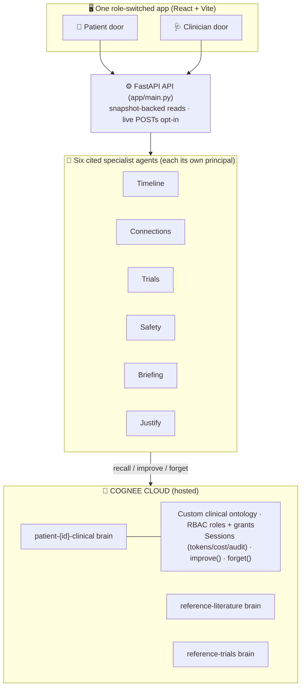
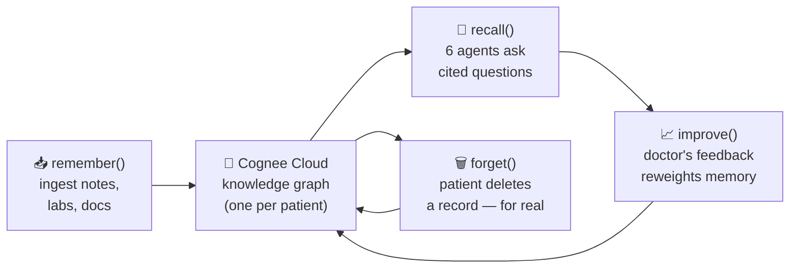
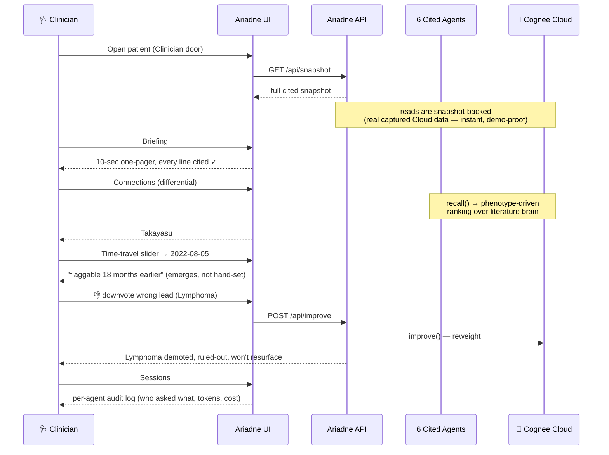
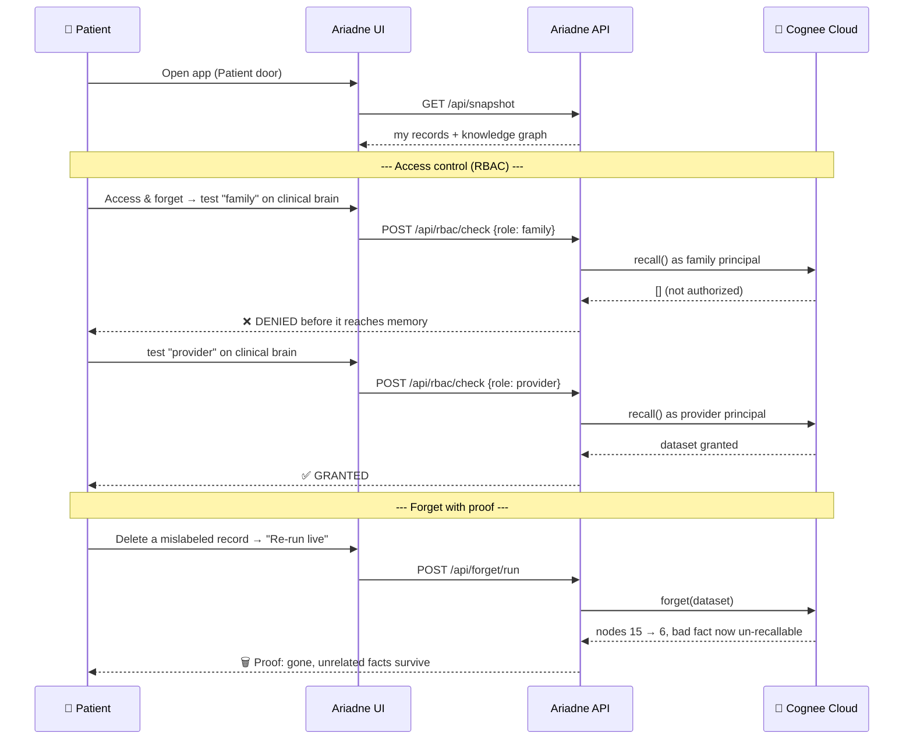
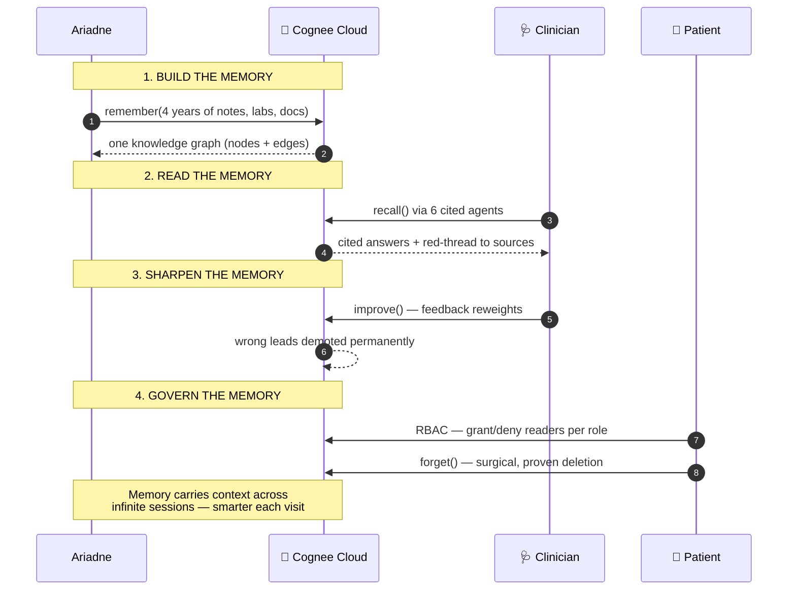

# Ariadne — Architecture & Diagrams

Plain-language explanation of how Ariadne works, with sequence diagrams for both doors
(Clinician and Patient) and the Cognee memory lifecycle. All diagrams are Mermaid — they
render directly on GitHub.

---

## The one-sentence version

> **Ariadne takes a patient's scattered medical history, pours it into one "memory brain" on
> Cognee Cloud, and lets six specialist AI agents read that brain to surface answers — every
> one traceable back to the note it came from.**

A patient sees 7 doctors over 4 years. Each doctor sees only their own slice and gives a
plausible-but-wrong label. **The clues were always there — just never in one place.** Ariadne
is the "one place," and the thread that connects the clues.

---

## The two doors

The same memory brain, two very different users:

| Door | Who | What they do |
| --- | --- | --- |
| 🩺 **Clinician** | Doctor | *Reads* the brain — briefing, timeline, differential, trials, safety, prior-auth — and gives feedback that sharpens it. |
| 🙋 **Patient** | The data owner | *Controls* the brain — sees their own records, grants/denies who can read it (RBAC), and permanently deletes records (forget-with-proof). |

---

## System architecture

---

## The Cognee lifecycle — the four verbs

Everything Ariadne does maps to Cognee's four memory operations:

- **remember()** → the patient's messy history becomes structured graph nodes + edges.
- **recall()** → agents ask questions; Cognee auto-routes between semantic similarity and deep
  graph traversal.
- **improve()** → a doctor downvotes a wrong lead; it's demoted and never comes back.
- **forget()** → the patient surgically deletes a record; it's genuinely gone (15 nodes → 6).

---

## Sequence diagram — 🩺 Clinician door

The doctor opens the app before a visit and reads the patient's story:

**In words:** doctor opens the patient → gets a cited pre-visit briefing → sees the differential
with a "red thread" proving each finding traces to a real note → the time-travel view shows it
was catchable 18 months sooner → the doctor downvotes a distraction and memory gets smarter →
every agent's work is logged for audit.

---

## Sequence diagram — 🙋 Patient door

The patient owns the brain and controls access:

**In words:** the patient sees their own data → proves access control works live (family is
blocked, provider is allowed — enforced *before* memory is touched) → deletes a bad record and
gets **proof** it's truly gone (node count drops, the bad fact is no longer recallable,
everything else survives).

---

## Full lifecycle — how a patient's memory evolves over time

---

## Why this is "Best Use of Cognee Cloud"

Every Cloud-only feature is **load-bearing**, not decoration:

| Cognee Cloud capability | How Ariadne depends on it |
| --- | --- |
| **Hybrid graph + vector memory** | The whole point — it *connects* clues that plain vector search can't. |
| **Multi-tenant RBAC** | The patient really controls who reads their brain (family denied, provider allowed). |
| **Agents as principals** | Each of the six agents runs under its own identity → every recall is attributable. |
| **Sessions** | Free observability/audit: who asked what, tokens, cost — per agent. |
| **improve() / memify** | Memory sharpens from clinician feedback and never regresses. |
| **forget()** | Records can be truly, provably erased on the patient's command. |
| **Custom ontology** | A clinical `graph_model` gives the memory medical structure (conditions, meds, findings, events). |

**The headline:** Ariadne turned 4 scattered years into one answer, **18 months sooner** — and
shows its work at every step.
