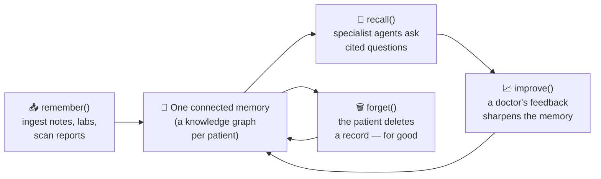
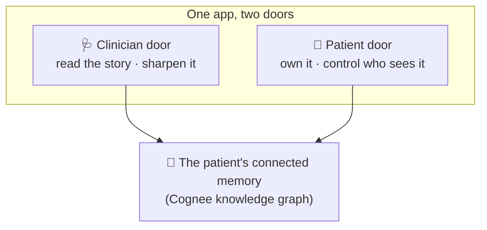
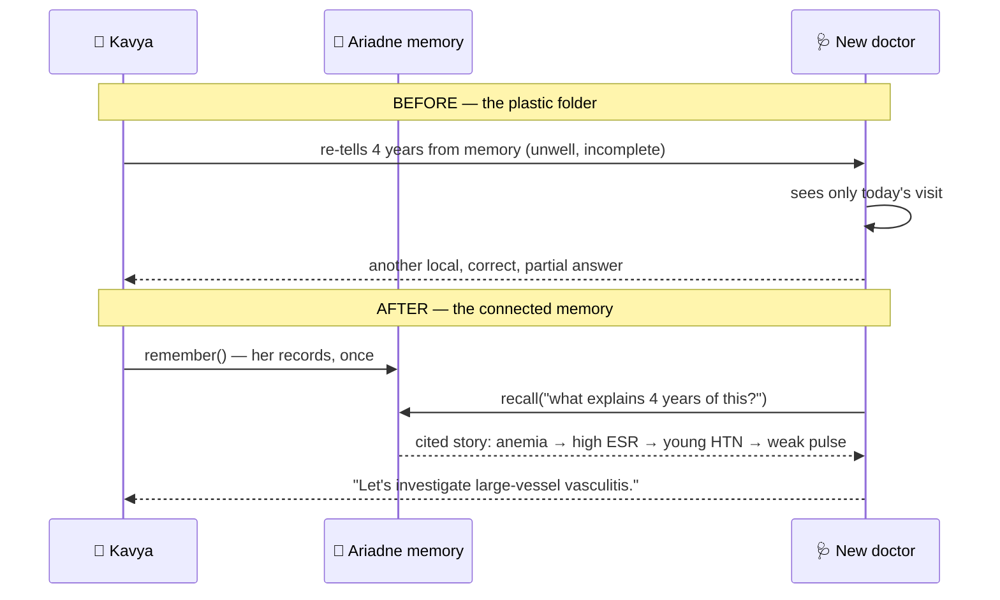
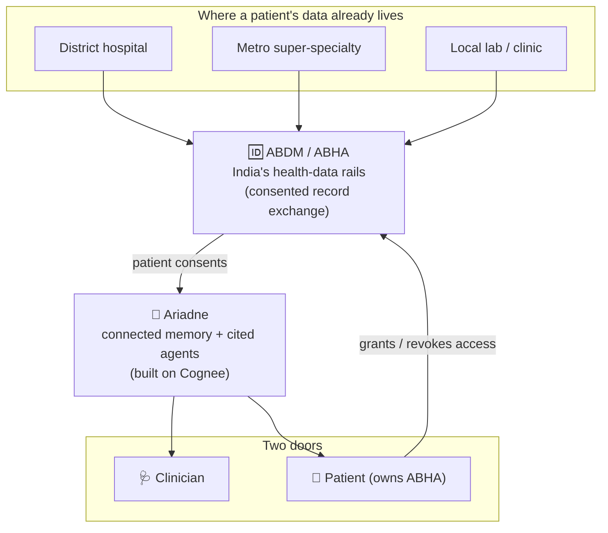

# The Girl Whose Pulse Went Missing

### What four lost years taught me about memory, medicine, and why India needs software that never forgets

---

Kavya was nineteen when her right arm started lying to her.

She noticed it in a stationery shop in Pune, of all places, reaching for a notebook on a high shelf. Her arm went cold and heavy halfway up, like the signal from her shoulder was arriving late. She shook it out, blamed the fan, bought the notebook, went home. She was a second-year B.Com student. She had exams. An arm that felt "a little weird" did not make the list of things worth worrying about.

That was the first entry in a diary nobody was keeping.

I met Kavya's file — not Kavya, her *file* — three years later, as a thick plastic folder held together with a rubber band. If you have ever sat in the corridor of a government medical college in India, you know this folder. Dog-eared prescription slips. Lab reports on thermal paper already fading to ghost-grey. A CD of a scan that no computer in the building could still read. Four years of a young woman's life, and not one page knew what the page before it said.

This is a story about that folder. And about what happens when you finally teach it to remember.

---

## Four years, seven doctors, one story told in pieces

Let me tell you how the four years actually went, because the shape of it matters.

**Year one.** Kavya is tired all the time. She runs a low fever that comes and goes. She loses a little weight. A local physician near her college checks her, finds she is anemic — low hemoglobin, not unusual for a young Indian woman — and starts iron tablets. "Eat well, sleep more, less stress." It is not wrong. It is just not the whole thing.

**Year two.** The fatigue is worse. A different doctor, because she has moved cities for an internship, runs an ESR test. It is high — a sign of inflammation somewhere in the body. But inflammation is a smoke alarm, not an address. Typhoid is ruled out. Tuberculosis is considered, because in India it always is, and reasonably so. Nothing conclusive. She is told it might be "post-viral." She is given rest.

**Year three.** Headaches. Then, at a routine check for a job medical, a shock: her blood pressure is very high. She is twenty-two. Nobody's grandmother, no family history, no obvious reason. She is started on blood-pressure medication. It barely works. She is labelled "resistant hypertension" and sent home with a second pill.

Here is the thing a doctor reading *only that visit* could not see: high blood pressure in a thin twenty-two-year-old woman is not the same disease as high blood pressure in a sedentary fifty-year-old man. In the young, it is often *secondary* — a symptom of something upstream. Her kidneys weren't the problem. The arteries *feeding* her kidneys were narrowing.

**Year four.** A sharp junior doctor in a metro super-specialty hospital does something almost old-fashioned. She feels for the pulse in both of Kavya's wrists. One is strong. The other is barely there.

That absent pulse had a name, and the name had been waiting in the folder for four years.

---

## The disease that hides in plain sight

Kavya has **Takayasu arteritis**. Doctors sometimes call it, with grim poetry, **"pulseless disease."**

It is an inflammation of the body's largest blood vessels — the aorta and the arteries branching off it — that slowly thickens and narrows them. Starve an artery to the arm, and the pulse fades; that is the "pulseless" part. Starve the arteries to the kidneys, and the kidneys, panicking, scream for more pressure — and you get severe high blood pressure in someone far too young for it. ([Overview of Takayasu arteritis, Wikipedia](https://en.wikipedia.org/wiki/Takayasu%27s_arteritis).)

Two facts about this disease make Kavya's story not a fluke but a pattern:

1. **It overwhelmingly strikes young women, and it is notably more common in Asia.** It typically announces itself between the ages of 15 and 30, and women are affected roughly *eight to nine times* more often than men. In the West, narrowed aortic branches usually mean atherosclerosis in the elderly; across much of Asia, Takayasu is a far more familiar cause in the young. Kavya's demographic profile isn't unusual for this disease — it is the *textbook*.

2. **Its early face is a liar.** In its first "inflammatory phase," Takayasu looks like tiredness, low fever, weight loss, aches, anemia, and a high ESR — the exact non-specific signals that, taken one visit at a time, sensibly get read as anemia, or a viral hangover, or stress. Only later does the "pulseless phase" arrive with its unmistakable signs. By then, arteries have been quietly narrowing for years.

Every single doctor Kavya saw was *locally correct*. The anemia was real. The high ESR was real. The blood pressure was real. Each was a true sentence. Nobody got to read the paragraph.

> **A necessary line, said plainly:** Kavya is a composite — a synthetic patient built from the textbook so I can tell this honestly, without touching anyone's real records. But there is no invention in the *shape* of her journey. Ask any rheumatologist in an Indian metro how often "young woman, years of vague symptoms, finally a missing pulse" walks through their door.

---

## Why India makes this so much harder

If you build health software, you have to be honest about the ground you are building on. India's is uniquely hard, in ways that turn a difficult diagnosis into a four-year one.

**Your medical history lives in a plastic bag.** There is no single thread connecting the physician near Kavya's college, the internship-city doctor, and the metro hospital. Each visit starts from zero. The patient *is* the integration layer — she is expected to carry, remember, and re-narrate four years of history at every new desk, often while unwell. Miss a report, forget a date, and that clue simply doesn't exist for the next doctor.

**You pay as you go, so you shop around.** India's public system is real but stretched, and the private sector delivers much of the care. Out-of-pocket spending was around **42% of current health expenditure** as recently as 2019, and India's total health spend sits near **3.2% of GDP — among the lowest in the world** ([National Health Accounts, via *Healthcare in India*, Wikipedia](https://en.wikipedia.org/wiki/Healthcare_in_India)). When every test comes out of your own pocket, you second-guess, you switch doctors, you repeat scans you already had because the last one is on an unreadable CD. Fragmentation isn't a bug of the system; it's the water everyone swims in.

**The good news: India is already building the missing rail.** The **Ayushman Bharat Digital Mission (ABDM)**, run by the National Health Authority, is creating exactly the connective tissue Kavya lacked: a portable health identity (**ABHA**) and a standards-based way to link a person's records across hospitals ([ABDM, Wikipedia](https://en.wikipedia.org/wiki/Ayushman_Bharat_Digital_Mission)). ABDM can carry the *documents* between doctors. But a folder that travels is still a folder. Handing the metro doctor four years of PDFs in one download does not, by itself, tell her *the pulse was already fading eighteen months ago.*

That last mile — from **connected records** to **connected understanding** — is the gap. That is the gap we tried to close.

---

## The real problem was never missing data. It was disconnected data.

This is the sentence the whole project turns on, so I'll give it its own line:

> Kavya's diagnosis wasn't late because a clue was missing. It was late because the clues were never in the same room.

The anemia (year one), the high ESR (year two), the young-person hypertension (year three), the weak pulse (year four) — line them up *next to each other* and they stop being four unrelated complaints. They become one disease, telling its story in order. The tragedy of the plastic folder is that it held every clue and connected none of them.

So we stopped thinking about storage, and started thinking about **memory**.

---

## Ariadne: a memory that carries the whole story

We built a system we call **Ariadne** — after the thread that guided Theseus out of the labyrinth. Because that is what a patient in India is missing: not more tests, but a thread.

The idea is simple to say. **Take everything about one patient — every note, lab, scan report, prescription — and pour it into a single memory that understands how the pieces connect. Then let specialist AI agents read that memory and surface what no single visit could see. And make every answer point back to the exact note it came from, so a doctor can trust it.**

Under the hood, that memory is a **knowledge graph** built on **[Cognee](https://www.cognee.ai/)**, a memory layer for AI. Instead of storing Kavya's history as a pile of documents, Cognee turns it into a web of *connected facts*: this symptom, on this date, links to that lab value, links to this medication, links to that vascular sign. The connections are the point. That is how "anemia in 2021" and "missing pulse in 2024" end up close enough to touch.

Cognee gives us four operations, and they map cleanly onto a patient's real life:

- **remember()** — ingest a new report into the patient's graph.
- **recall()** — ask the memory a question and get an answer *with its sources*.
- **improve()** — let a doctor's feedback make the memory sharper over time.
- **forget()** — let the patient permanently delete a record, for real.

Here is the whole lifecycle in one picture:


*Figure 1 — The memory lifecycle. A patient's scattered history becomes one connected memory that can be questioned, corrected, and — on the patient's command — erased.*

---

## What it feels like to use

Ariadne has **two doors into the same memory**, because a health record has two rightful owners with very different needs.


*Figure 2 — Two doors, one memory. The clinician reads and improves; the patient owns and governs.*

**Through the clinician's door,** the doctor who finally felt Kavya's pulse would have opened her file and seen, in ten seconds, not a plastic bag but a briefing: active problems, current medicines, the through-line of her four years — every line footnoted to the note it came from. She would have seen a differential that weighed Kavya's *whole* pattern and put large-vessel vasculitis at the top, not because a black box said so, but with the reasoning laid out and each step cited. And she would have seen the moment that still gives me chills.

**Through the patient's door,** Kavya herself owns the memory. She decides which doctor gets to read it. She can point at a wrong label from year two and have it deleted — and *prove* it's gone. In a country where "consent" for health data is too often a signature no one explains, that ownership is not a feature. It is the whole ethic.

Here is Kavya's journey, before and after, as a doctor experiences it:


*Figure 3 — The same patient, two worlds. In the first, the doctor inherits a folder and starts from zero. In the second, she inherits a memory and starts from the truth.*

---

## The moment that matters

Ariadne has one feature we call *time-travel*, and it is the reason the project exists.

You can drag a slider back through Kavya's history. At any past date, the system looks *only* at the notes that existed by then, rebuilds her pattern as it stood in that moment, and re-runs the same reasoning. It answers a haunting question: **on that day, with what was already written down, could this have been caught?**

For our Kavya, the answer lands on a date roughly **eighteen months before** her real diagnosis — the day a genuine vascular sign first appeared in the record, sitting quietly next to the anemia and the inflammation that everyone had already seen. Connected, those clues cross a line. Scattered, they never did.

I want to be scrupulously honest about that number, because honesty is the only thing that makes it worth anything: **eighteen months is a result computed from our synthetic patient, not a clinical trial claim.** And the system is deliberately conservative — it only raises the flag when a *real* vascular sign is present, never on vague overlap alone. It is decision *support*, always with a human doctor holding the pen. It is not a diagnosis, and it is not a medical device.

But the principle beneath the number is rock-solid and needs no disclaimer: **when a patient's memory is connected instead of scattered, the story becomes visible earlier.** Eighteen months earlier, for Kavya, is the difference between blood-pressure pills that don't work and treatment for the actual disease. It is arteries that don't narrow for another year and a half.

---

## From a demo to a product India could actually use

A hackathon demo is a promise. Here is how the promise becomes a product on Indian soil.


*Figure 4 — The product, on India's own rails. ABDM moves the records with consent; Ariadne turns those records into connected, cited understanding. The patient's ABHA is the key they hold.*

**The wedge is ABDM.** India is already laying the rails to move records between hospitals with patient consent. Ariadne is the layer that sits on top and answers the question ABDM alone can't: *so what does all this mean, together?* We don't have to convince India to build a health-ID system. It's building one. We make it *smart*.

**Where it earns its place first:**

- **Rheumatology and nephrology clinics in metros**, which are the graveyards of diagnostic odysseys — the place patients like Kavya finally arrive after years. A ten-second cited briefing per patient is worth real money in clinician time and repeated tests avoided.
- **Second-opinion and referral centres**, where a doctor inherits a stranger's four years in a plastic bag and has fifteen minutes to make sense of it.
- **Patient-held records for chronic and rare diseases**, where the person themselves is the only constant across a decade of providers — and should own the memory to match.

**Why it's defensible.** Anyone can bolt a chatbot onto a pile of PDFs. What's hard, and what Cognee makes possible, is a memory that (a) *connects* facts across years instead of just searching them, (b) *cites every answer* so a doctor can trust it, (c) *learns* from clinician feedback and never repeats a corrected mistake, and (d) is *owned and erasable* by the patient. That combination — connected, cited, self-improving, patient-owned — is the moat. A folder can't do it. Plain search can't do it. A memory can.

---

## What I'm not claiming

I owe you the limits, because a project you can't trust isn't worth winning with.

- Kavya is **synthetic**. No real patient data was used. The eighteen-month figure is from her, our built example — a demonstration of a principle, not a clinical result.
- Ariadne is **decision support**, not a diagnosis and not a medical device. Every finding is framed as "consider / investigate," a human clinician always decides, and any claim without a traceable citation is suppressed by design.
- Real deployment on ABDM would demand the hard, unglamorous work of clinical validation, data governance, security review, and regulatory diligence. This is the beginning of that argument, not the end of it.

---

## The thread

I keep coming back to that plastic folder, held together with a rubber band, holding four years and connecting none of it.

Every clue Kavya needed was already written down. The anemia. The inflammation. The young woman's impossible blood pressure. The pulse that had quietly gone missing. The diagnosis wasn't hiding in some test nobody ordered. It was hiding in *the space between the pages* — in the connections no one was there to draw.

We spend fortunes teaching machines to be clever. Maybe the more humane goal, especially for a country where your medical history rides in a bag on the back of a scooter from one hospital to the next, is to teach them to *remember* — to hold a person's whole story in one place, to point to their sources when they speak, and to hand the keys back to the person the story belongs to.

Ariadne is a thread. It won't walk anyone out of the labyrinth by itself.

But no one should have to find the way out with the lights off, holding four years of their own life in a plastic bag, hoping the next doctor has time to read all of it before the exam bell of their appointment rings.

We can do better than a folder. We can give them a memory.

---

*Ariadne was built for a hackathon on the theme "Best Use of Cognee." It uses Cognee's memory lifecycle — remember, recall, improve, forget — as its core. Code and technical documentation: [github.com/karan68/ariadne](https://github.com/karan68/ariadne). Kavya is a synthetic patient; nothing here is medical advice.*

---

### A note on the diagrams

All four figures are written in **Mermaid**. Medium doesn't render Mermaid directly, so to include them:

1. Go to **[mermaid.live](https://mermaid.live)**.
2. Paste a diagram's code block (everything between the ` ```mermaid ` fences).
3. Export as **PNG** (or SVG) and upload the image into your Medium draft, using the italic *Figure* line as the caption.

The diagrams are intentionally simple and legible at small sizes so they read well on a phone, which is how most of India will see them.
